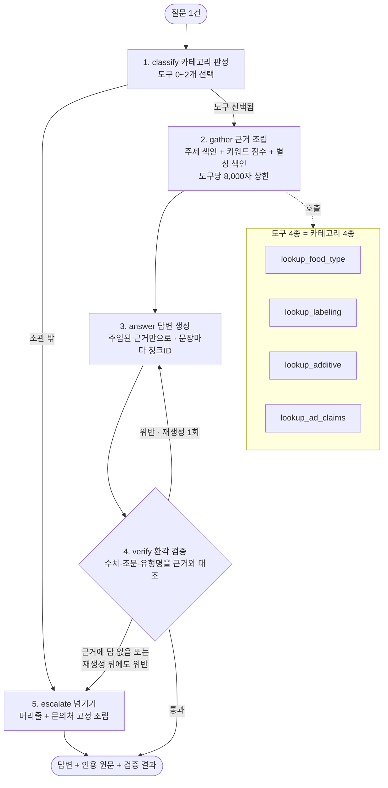
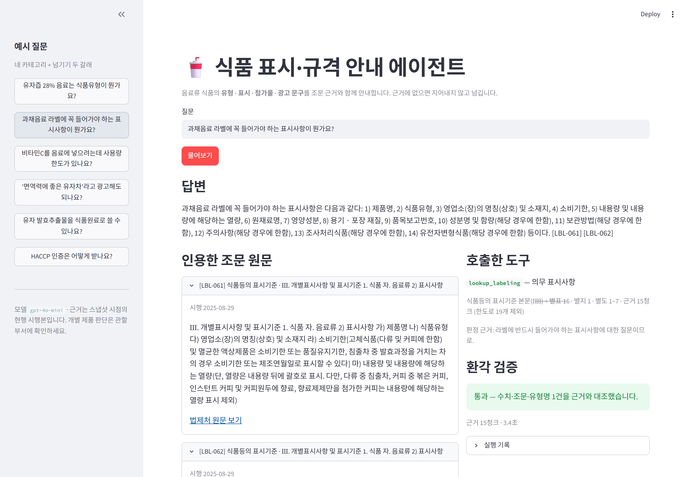
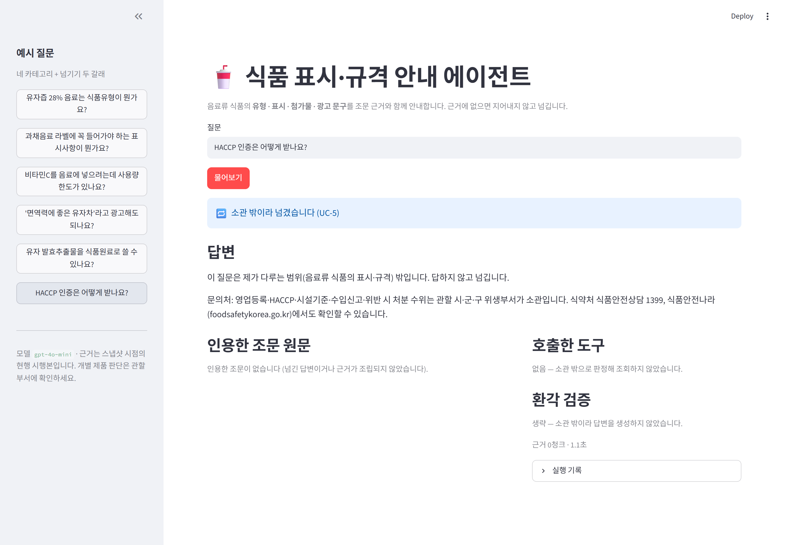

# REPORT — 식품 표시·규격 라우팅 에이전트

아이펠 AI 에이전트 1기 · **에이전트 팀 꾸리기_Agt1** 5번 노드 「고객 응대 에이전트 만들기 [프로젝트]」

| | |
|---|---|
| 저장소 | `aiffel-quests/agentteam-m05-customer-support-agent` |
| 실행법·파일 구조 | [README.md](README.md) |
| 요구사항 (사용자 관점) | [PRD.md](PRD.md) · 작업계획 [PLAN.md](PLAN.md) |
| 코퍼스 스냅샷 | 2026-09-17 · 6개 자료 1,241 청크 |
| 모델 | 파이프라인 `gpt-4o-mini` · 채점기 `gpt-4o-mini` (별도 축) |

이 문서는 과제가 요구하는 7항목을 담는다. 각 항목의 **판단 근거와 실측 원본은
`docs/` 의 개별 문서**에 있고, 여기서는 결론과 수치를 모은다.

---

## 1. 주제와 근거 문서

### 무엇을 푸는가

> 음료 브랜드를 준비하는 **비전문가**가, 내 제품의 **유형·표시·첨가물·광고 문구**를
> **조문 근거와 함께** 확인하고, 근거가 없으면 지어내지 않고 **넘겨받게** 한다.

품목제조보고와 라벨 인쇄를 앞둔 대표·식품MD 가 막히는 자리다. 지금의 선택지는 셋인데
— 수천 페이지 원문 직접 뒤지기 / 컨설팅 / 범용 LLM — **세 번째가 이 프로젝트의 존재
이유다.** 첨가물 사용량 한도, 과즙 함량 기준, 활자 크기처럼 **틀려도 틀린 줄 모르는
숫자**가 도메인 전체에 깔려 있고, 근거 없는 답은 라벨 인쇄를 거쳐 실제 손해가 된다.

그래서 이 사용자가 가장 중요하게 여기는 것은 *답이 맞는지*가 아니라
**어디에 그렇게 쓰여 있는지**다. 이 한 줄이 설계 전체를 지배한다 — 답변마다 청크 ID 를
달게 하고, 화면에 조문 원문을 펼치고, 근거 밖 진술을 기계로 검사한다.

### 근거 문서 — 음료류 계열로 한정한 현행 시행본

| 코드 | 문서 | 시행일 | 청크 | 별표 |
|---|---|---|---|---|
| FLA | 식품 등의 표시·광고에 관한 법률 (제1~10조) | 2025-09-19 | 64 | — |
| FLD | 같은 법 시행령 (제1~6조) | 2025-09-19 | 20 | — |
| LBL | 식품등의 표시기준 (고시) | 2025-08-29 | 114 | 14개 87KB |
| UNF | 식품등의 부당한 표시 또는 광고의 내용 기준 (고시) | 2025-12-04 | 17 | 2개 5KB |
| FDC | 식품의 기준 및 규격 — 제5. 9. 음료류 + 제2. 식품일반 공통기준 | 2026-05-19 | 143 | — |
| FAC | 식품첨가물의 기준 및 규격 — 일반사용기준 + 품목별 사용기준 | 2025-11-26 | 883 | — |

합계 **1,241 청크**. 수집 경로와 파싱 규칙은 [docs/COLLECT-NOTES.md](docs/COLLECT-NOTES.md).

**수집에서 배운 것 둘** — 둘 다 계획의 전제가 틀렸던 자리다.

- **법제처 OPEN API 로 식품공전을 받을 수 없다.** 본문이 329자이고 실질 내용이 첨부파일이다.
  식품안전나라 「식품분야 공전 온라인 서비스」의 항목별 PDF 로 우회했다 (FDC·FAC).
- **공전 본문에는 아직 시행되지 않은 개정이 주석으로 섞여 있다.** 표 칸에 든 것은 잘라냈고,
  줄글에 겹친 것은 잘라낼 자리가 없어 **어느 청크가 그런지 기록만** 했다
  (`data/corpus/collection-report-fsd.json`).

스냅샷은 고정이다. 코퍼스를 다시 수집하면 청크 ID 가 밀려 평가셋의 `goldCheck` 정규식이
깨지므로, `data/corpus/` 를 커밋해 두고 다시 받지 않는다.

---

## 2. 카테고리 설계 (매핑표)

### 카테고리 = 도구 1:1

과제 지표 S1 이 「**실제로 호출한 도구 집합이 기대 집합과 정확히 일치하면 1점**」이다.
도구 경계가 흐릿하면 이 지표를 잴 수 없으므로 **카테고리와 도구를 1:1 로 붙였다.**
"카테고리 판정" = "어떤 도구를 부를지 정하는 일" 이 된다.

| 카테고리 / 도구 | 답하는 것 | 근거 범위 | 유즈케이스 |
|---|---|---|---|
| `lookup_food_type` | 내 제품이 어느 식품유형인가, 그 유형의 규격은 | 식품공전 제5. 9. 음료류 + 제2. 1. 식품원료 기준 + 제2. 2. 제조·가공기준 | UC-1 · UC-6 |
| `lookup_labeling` | 라벨에 반드시 들어가야 하는 것, 어떻게 적는가 | 표시기준 본문 Ⅰ~Ⅲ + 별표 1~6 · 별지 1 · 별도 1~7 | UC-2 |
| `lookup_additive` | 이 첨가물을 써도 되는가, 얼마까지, 라벨엔 뭐라 적나 | 첨가물공전 II. 2. 일반사용기준 + III. 품목별 사용기준, 식품공전 제2. 3. 3), 표시기준 별표 4~6 | UC-3 |
| `lookup_ad_claims` | 이 문구가 부당한 표시·광고에 걸리는가 | 표시광고법 제1~10조 + 시행령 제1~6조 + 부당표시광고 고시 + 별표 1~2 | UC-4 |

도구별 청크 수는 92 · 222 · 895 · 106. **범위는 청크 ID 가 아니라 위치 정규식으로**
적는다 (`^제5\. 9\. 음료류` 처럼) — 코퍼스를 다시 수집하면 ID 는 밀려도 자리는 그대로다.
전체 매핑표·주제 색인·첨가물 별칭 색인의 원본은
[docs/CATEGORY-MAP.md](docs/CATEGORY-MAP.md) 이고, `uv run python tools.py` 가
그 문서와 `tools.py` 의 `SCOPES`·`TOPICS` 가 어긋나면 종료 코드 1 을 낸다.

### 겹침은 없애지 않고 집합으로 채점한다

표시기준 **별표 4·5·6 은 `lookup_labeling` 과 `lookup_additive` 양쪽 범위에 있다.**
「이 첨가물 라벨에 뭐라 적나」는 첨가물 질문이고 「라벨에 뭐가 들어가야 하나」는 표시
질문인데 근거가 같은 표다. 도구를 더 쪼개는 대신 겹치게 두고 기대 도구를 집합으로 본다.

| 질문 모양 | 기대 도구 집합 |
|---|---|
| 「유자즙 28% 음료를 '유자주스'로 팔아도 되나요」 | `{lookup_food_type, lookup_labeling}` |
| 「이 첨가물 써도 되고 라벨엔 뭐라 적나요」 | `{lookup_additive}` (별표가 이 도구 범위에 있다) |
| HACCP·수입신고·처분 수위 (UC-5) | **`{}` 공집합** — 판정 노드가 걸러 조회하지 않는다 |
| 「유자 발효추출물을 식품원료로 쓸 수 있나요」 (UC-6) | `{lookup_food_type}` — 도구는 잡히고 답이 없다 |

**마지막 두 줄이 넘기기 두 갈래다.** `out_of_scope` 는 기대 도구가 공집합,
`no_evidence` 는 도구 1개. 한 노드에서 처리하면 이 구분이 사라져 S1 을 잴 수 없다.

### 검색은 벡터를 쓰지 않는다

주제 색인 + 키워드 점수 + (첨가물) 별칭 색인 세 겹이다. 이유는 **재현성**이다 —
같은 질의가 늘 같은 근거를 돌려줘야 「프롬프트 한 축만 바꾼 효과」를 잴 수 있다.
도구 1회 반환은 8,000자 이하로 자른다.

---

## 3. 평가셋 설계

`data/goldenset.json` — **18문항**. `uv run python validate_goldenset.py` 가 스키마·분포·
중복·`goldCheck`·금지 표현을 검사한다.

| 카테고리 | 문항 | 유즈케이스 |
|---|---|---|
| `food_type` | 4 (FT-1~4) | UC-1 ×3 · **UC-6 ×1** |
| `labeling` | 3 (LB-1~3) | UC-2 |
| `additive` | 3 (AD-1~3) | UC-3 |
| `ad_claims` | 4 (AC-1~4) | UC-4 |
| `multi` | 2 (MX-1~2) | UC-3+UC-2 · UC-1+UC-2 |
| `out_of_scope` | 2 (OS-1~2) | **UC-5** |

**넘기는 것이 정답인 문항 3건** (OS-1 · OS-2 = `out_of_scope`, FT-4 = `no_evidence`) 으로
PRD 요건(3건 이상, 두 갈래 각각 포함)을 채운다. 복수 카테고리 2건.

문항마다 넷을 적는다.

| 항목 | 무엇 | 쓰이는 곳 |
|---|---|---|
| `expectedTools` | 기대 도구 **집합** | S1 |
| `requiredFacts` | 답변에 반드시 있어야 하는 **사실** (표현이 아니라) | S2 |
| `forbiddenPhrases` | **문서를 안 읽었을 때 나오기 쉬운 그럴듯한 오답** | S2 |
| `gold` · `goldCheck` | 기대 근거 청크 ID + 그 청크를 되짚는 정규식 | 코퍼스 재수집 감지 |

금지 표현에는 실제와 다른 과즙 함량 기준값, 실제와 다른 첨가물 사용 한도처럼
**틀려도 그럴듯한 숫자**를 넣었다. `goldCheck` 는 청크 ID 가 밀렸을 때 평가셋이
조용히 다른 문서를 가리키는 것을 잡는다.

**프롬프트 예시용은 분리했다** — `data/prompt-examples.json` 의 4문항은 프롬프트에만 쓰고
점수에 넣지 않는다.

### 모범 답안 18문항 — 채점기를 채점한다

`data/reference-answers.json` 은 **gold 청크만 인용해** 사람이 쓴 답이다.
`evaluate.py --reference` 가 이걸 채점기에 넣어 전 문항 1점이 나오는지 본다 (S5).
떨어지면 **고칠 곳은 모범 답안이 아니라 채점기다.** 반대로 `--negative` 7건은
일부러 망친 답변이 0점으로 떨어지는지 본다 — 채점기가 느슨해지는 방향도 막는다.

---

## 4. 측정 결과 — 원인 분류와 개선 기록표

### 4-1. 채점기가 먼저 틀렸다

기준을 재려고 돌린 **첫 네 번의 측정은 버렸다.** S2 가 0.72~0.83 으로 흔들렸는데
흔들림의 출처가 파이프라인이 아니라 **채점기**였다.

- 같은 답변·같은 필수 사실을 온도 0 으로 6회 채점하니 **3회는 담았다, 3회는 안 담았다**
- 흔들림만이 아니라 **한쪽으로 치우친 오답**이 있었다. AD-1 의 답변은 「최소량으로
  사용해야 한다」 한 문장뿐인데, 전혀 다른 필수 사실을 **5회 중 5회 「담았다」**고 했다.
  주제가 비슷하면 담은 것으로 쳤다

고친 방식은 **에이전트에게 요구하는 것과 같은 규칙을 채점기에도 거는 것**이다.

1. 채점기가 먼저 **답변에서 그 사실을 말한 자리를 그대로 옮긴다**(`quote`) — 판정은 그 다음
2. **옮긴 자리가 답변에 실제로 있는지 규칙이 대조한다**(`quote_grounded`). 없으면 판정이
   무엇이든 「담지 않았다」로 친다
3. **사실마다 3회 물어 다수결**(`JUDGE_VOTES=3`)

거짓 통과는 예외 없이 **필수 사실 문장을 그대로 베껴 인용으로 내놓는** 모양이었고,
2번이 그걸 기계로 잡는다. 고친 뒤 S5 3회 연속 통과, `--negative` 7건 전부 0점.
자세한 것은 [docs/BASELINE.md](docs/BASELINE.md) 0절.

### 4-2. 기준선과 오답 원인 분류

18문항 · `gpt-4o-mini` · 3회 실행.

| 실행 | S1 | S2 | S3 | S4 |
|---|---|---|---|---|
| `baseline` | 0.78 (14/18) | 0.61 | 0건 | 0건 |
| `baseline-2` | 0.78 | 0.56 | 0건 | 0건 |
| `baseline-3` | 0.78 | 0.67 | 0건 | 0건 |
| **기준** | ≥ 0.75 | ≥ 0.75 | 0건 | 0건 |

> **이 절과 4-3 의 S2 값은 개선 회차 당시의 채점기로 잰 것이다.** 회차를 끝낸 뒤 채점기를
> 한 번 더 고쳤고, 같은 답변을 새 잣대로 다시 잰 값은 4-5·4-6 에 있다 (기준선 0.67·0.61·0.67).
> 회차 사이의 비교는 같은 잣대끼리만 한 것이고, 최종 판정은 4-6 의 수치로 한다.

**기준 미달은 S2 하나다.** S1·S3·S4 는 넘었으므로 개선 목표에서 빼되 매 회차 계속 재고,
다른 축을 고치다 이 셋이 깨지면 그 회차를 되돌린다.

원인 분류 여섯 중 **둘만 나왔다** — `도구 범위 밖`·`발췌 누락`·`라우팅 누락`은 3회 통틀어 0건.

| 원인 | 문항 | 3회 중 | 고칠 축 |
|---|---|---|---|
| `라우팅 과선택` | FT-1 · AD-3 · AC-2 · AC-3 | **3/3 (항상)** | `router_prompt` |
| `답변 누락` | FT-3 · LB-1 · AD-1 · AD-2 · AC-1 | **3/3 (항상)** | `answer_prompt` |
| `답변 누락` | LB-2 | 2/3 | `answer_prompt` |
| `답변 누락` | FT-1 · MX-1 | 1/3 | `answer_prompt` |
| `답변 누락` | AD-3 | 2/3 | **계측 문제 — 개선 대상에서 뺐다** |

두 가지가 눈에 띈다.

- **라우팅 과선택 4문항은 전부 「하나를 더 골랐다」다.** 기대 도구를 빠뜨린 문항은 없다.
- **답변 누락은 전부 같은 모양이다** — 필수 사실 둘 중 하나만 쓰고 나머지를 버린다.

### 4-3. 개선 기록표 — 5회, 매회 재측정 (S6)

**한 회차에 한 축만 바꾼다.** 약속이 아니라 코드가 강제한다 (아래 4-4).

| 회차 | 바꾼 축 | 무엇을 | 왜 그 축인가 | S1 | S2 | S3 | S4 |
|---|---|---|---|---|---|---|---|
| 기준선 | — | — | — | 0.78 ×3 | **0.61 · 0.56 · 0.67** | 0 | 0 |
| 1회차 | `answer_prompt` | 「400자 안팎으로 짧게」를 걷어내고 **갈래·열거·조건을 끝까지 쓰게** 했다 | 원인 분류 1순위 — S2 실패가 예외 없이 「둘 중 하나만 쓰고 버린다」 | 0.78 ×2 | **0.67 · 0.67** | 0 | 0 |
| 2회차 | `answer_prompt` | 근거가 **다른 조항을 가리키는 말**로 답하면 그 가리킴 자체를 옮겨 적게 | 1회차 뒤에도 AD-1·MX-1 이 「수치 한도가 따로 없다」를 계속 버렸다 | 0.83 · 0.78 · 0.83 | 0.67 · 0.72 · 0.61 | 0 | **1 · 0 · 0** |
| 3회차 | `answer_prompt` | **수치가 무엇에 걸리는 값인지** 함께 적게 | LB-2·MX-2 가 수치는 옳게 옮기고 걸리는 대상을 바꿨다 | 0.83 · 0.78 | 0.61 · 0.67 | 0 | 0 |
| **4회차** | `answer_prompt` | 「끝까지 쓴다」를 **`answered` 갈래에만** 걸고, `no_evidence` 는 반대로 짧게 | 1~3회차가 총점을 못 움직인 이유 — 1회차가 FT-3 를 붙이면서 **FT-4 를 깨뜨렸다.** 두 갈래에 같은 지시가 걸려 있었다 | 0.78 ×3 | **0.72 · 0.72 · 0.67** | 0 | 0 |
| 5회차 | `answer_prompt` | 2회차의 「가리키는 말 옮겨 적기」를 **`answered` 에만** 걸어 재시도 | 4회차 뒤 남은 유일한 진짜 실패가 AD-1 이었다 | 0.78 ×2 | 0.61 · 0.72 | 0 | 0 |

회차마다 **2회 이상** 측정했다 — 1회 측정은 잡음을 개선으로 적게 된다.
기록 파일은 `data/runs/r1-a.json` ~ `r5-b.json`.

**최종 상태는 1회차 + 4회차다.** 2·3·5회차는 되돌렸다.

- **2회차 되돌림** — S2 가 기준선 폭 안이고 **S4 가 한 번 깨졌다.** FT-4 에서 넘기지 않고
  답했다. 「가리키는 곳이 근거에 없어도 그 문장을 버리지 않는다」가 답변 규칙
  「근거에 답이 없으면 넘긴다」를 밀어낸다
- **3회차 되돌림** — 겨눈 LB-2 가 2회 다 0점이고 S2 평균이 1회차보다 낮다
- **5회차 되돌림** — 겨눈 AD-1 은 붙었는데 FT-3·MX-1 이 대신 깨졌다

전 회차 기록과 되돌린 이유는 [docs/IMPROVEMENTS.md](docs/IMPROVEMENTS.md).

### 4-4. 축 가드 — 두 축을 바꾸면 돌리기 전에 거부한다

`evaluate.py --against <직전 기록>` 이 `RunConfig`(네 축의 **내용 해시**)를 대조하고,
두 축 이상 다르면 **종료 코드 2로 파이프라인을 돌리기 전에 멈춘다.** 거부할 실행에
18문항치 LLM 호출을 태울 이유가 없다.

```
축 가드 — 직전 기록 baseline-3.json
  바뀜 router_prompt d07e8b28 → d2f5aada
  바뀜 answer_prompt 6bcb1d57 → 372cfe61
    =  topic_index   a7cd423f
    =  model         gpt-4o-mini

거부 (종료 코드 2) — 한 회차에 2축이 바뀌었다: router_prompt, answer_prompt
```

버전을 손으로 적는 번호로 뒀다면 올리는 것을 잊은 회차가 「한 축」으로 기록된다.
내용 해시라 그럴 수 없다.

### 4-5. 잣대를 고치고 **기준선부터 전부 다시 쟀다**

개선 회차를 끝낸 뒤, 남은 실패의 절반이 **계측 문제**임이 드러났다.
`quote_grounded` 가 인용을 답변의 **이어진 부분 문자열**로만 찾는데, 채점기는 답변 여러
줄에서 한 문장을 만들어 온다. LB-1 은 10회 실행 모두 0점이었지만 0점인 **이유가 1회차를
기점으로 바뀌어 있었다** — 기준선에서는 진짜 누락이었고, 1회차 이후로는 답변이 1)~14) 를
전부 적는데 채점기 인용이 10)·11) 을 건너뛰어 베껴서 떨어졌다.

고친 규칙: 인용을 `,`·`;`·`·`·줄바꿈에서 쪼개고 **조각이 답변에 나온 순서대로** 다 있으면
통과. 순서를 요구하는 이유는 흩어져 있어도 통과시키면 막아 둔 거짓 통과가 되살아나기
때문이다.

**채점기를 고치는 것은 개선 축이 아니라 잣대를 바꾸는 일이므로, 기준선부터 같은 잣대로
다시 쟀다.** `evaluate.py --score` 가 기록 파일을 읽어 **같은 답변에 새 잣대만** 대므로
파이프라인을 다시 돌릴 필요가 없었다 (재측정 비용이 채점 호출만 남는다).

| 확인 | 결과 |
|---|---|
| `--reference` (S5) | 모범 답안 18문항 전부 S1~S4 1점, gold 밖 인용 0건 |
| `--negative` 7건 | 의도한 지표를 놓친 것 0 — 망친 답변은 그대로 0점 |
| `--selftest` | 실패 0 (API 키 없이 규칙 층 확인) |
| S1·S3·S4 재채점 | 전 실행에서 값이 그대로 — **고친 것이 S2 인용 대조뿐임을 보여준다** |

### 4-6. 최종 수치

새 잣대 + 최종 프롬프트(1+4회차)로 **처음부터 끝까지 5회** (`data/runs/final-a~e.json`).

| 지표 | 기준 | 같은 잣대 기준선 3회 | **최종 5회** | 판정 |
|---|---|---|---|---|
| S1 도구 집합 | ≥ 0.75 | 0.78 · 0.78 · 0.78 | 0.78 (5회 모두) | 넘음 |
| S2 답변 적절성 | ≥ 0.75 | 0.67 · 0.61 · 0.67 (평균 **0.648**) | 0.72 · 0.78 · 0.78 · 0.72 · 0.83 (평균 **0.767** · 중앙값 0.78) | 넘음 |
| S3 근거 밖 진술 | 0건 | 0 | 0 (5회 모두) | 넘음 |
| S4 넘기기 | 0건 | 0 | 0 (5회 모두) | 넘음 |
| S5 채점기 역검증 | 전 문항 1점 | — | 통과 | 넘음 |
| S6 개선 3회 이상 | 3회 | — | 5회, 매회 2~3번 측정 | 넘음 |
| S7 데모 근거 확인 | 한 화면 | — | 6절 | 넘음 |

**기준선의 최고(0.67)가 최종의 최저(0.72)보다 낮다** — 두 분포가 겹치지 않는다.
개선은 잡음이 아니다.

> **단서를 숨기지 않고 적는다.** 5회 중 2회(0.72)가 기준 아래다. S2 는 문항 하나가
> 0.056 이라 회차마다 흔들린다. 여기서는 **5회 평균(0.767)과 중앙값(0.78)** 을 최종
> 수치로 읽어 충족으로 적었다. **회차 하나하나가 전부 0.75 이상이어야 한다고 읽으면
> 아직 미달이다.** 읽는 사람이 갈릴 수 있어 숫자를 다 적어 둔다.
> PRD 4절이 허용한 「기준 1회 조정」은 쓰지 않았다 — 기준은 처음 값 그대로다.

---

## 5. 파이프라인 구조도



LangGraph `StateGraph` 5노드. 설계에서 중요한 것은 셋이다.

**① 넘기기는 두 갈래다.**

| 갈래 | 누가 정하나 | 뜻 | 기대 도구 |
|---|---|---|---|
| `out_of_scope` | **판정 노드** | 소관이 아니다 (HACCP·수입신고·처분 수위) | `{}` 공집합 — 근거 조립도 답변 생성도 건너뛴다 |
| `no_evidence` | **답변 노드** | 소관이지만 발췌한 근거에 답이 없다 | 해당 도구 1개 — 조회는 하고 답을 안 만든다 |

UC-5 와 UC-6 의 차이다. 한 노드에서 처리하면 S1 을 잴 수 없고, 사용자도
「범위 밖」과 「모르겠다」를 구분할 수 없다.

**② 검증에 걸리면 한 번 재생성하고, 그래도 걸리면 본문을 버리고 넘긴다** (`MAX_ATTEMPTS=2`).
틀린 답을 고쳐 내보내는 것보다 넘기는 쪽이 이 사용자에게 안전하다.

**③ 넘기기 본문은 LLM 이 쓰지 않고 규칙이 조립한다.** 머리줄과 문의처 줄이 고정이라
「넘겼는가」와 「어디에 물어야 하는지 알려줬는가」를 기계로 잴 수 있다.
`no_evidence` 는 답변자가 쓴 「근거가 어디까지 말하는지」를 가운데 그대로 끼운다 —
이걸 버리면 사용자가 무엇이 확인되고 무엇이 안 됐는지 알 수 없다.

### 환각 검증 규칙이 하는 일

답변에서 **수치·조문 표기·식품유형명**을 뽑아 주입된 근거 텍스트와 대조한다.
없으면 위반이다. 잡지 못하는 것도 [docs/VERIFY-NOTES.md](docs/VERIFY-NOTES.md) 에 적어 뒀다 —
근거가 넓으면 엉뚱한 자리의 같은 숫자에 걸려 통과하고, **실재하지 않는 식품유형명은
애초에 뽑히지 않는다.**

---

## 6. 데모 설계

```bash
uv run streamlit run app.py
```

**한 화면에 넷을 같이 둔다** — 답변 · 호출한 도구 · **인용한 조문 원문** · 환각 검증 결과.
넷이 흩어져 있으면 「근거를 보여준다」가 말뿐이 된다. PRD 의 사용자는 받은 답을 OEM 공장·
컨설턴트에게 **그대로 전달**해야 하므로, 답변 한 줄을 읽고 바로 아래에서 그 근거의 원문과
법제처 링크를 열 수 있어야 한다 (UC-7).

### 화면 1 — 답변 · 근거 · 검증이 한 화면에 (S7)



「과채음료 라벨에 꼭 들어가야 하는 표시사항이 뭔가요?」 한 건에서 넷이 동시에 보인다.

- **답변** — 1)~14) 를 열거하고 문장 끝에 `[LBL-061] [LBL-062]`
- **인용한 조문 원문** — 그 청크를 펼쳐 **원문 그대로** + 시행일 + 법제처 원문 링크
- **호출한 도구** — `lookup_labeling`, 범위와 근거 15청크(한도로 19개 제외), 판정 근거
- **환각 검증** — 통과, 수치·조문·유형명 1건 대조

### 화면 2 — 넘긴 경우 배지가 먼저 뜬다



「HACCP 인증은 어떻게 받나요?」 — **왜 답을 안 줬는지가 답변만큼 중요하므로** 배지를
답변보다 위에 둔다. 어느 갈래로 넘겼는지(UC-5/UC-6)가 배지에 붙고, 도구 0개 ·
인용 0건 · 검증 생략이 그 판정과 일관되게 나온다.

### 화면에만 있는 것 둘

CLI(`uv run python -m agent "<질문>"`)와 같은 내용을 보여주되, 화면 쪽에만 둔 것이 둘이다.

- **예시 질문 버튼** — 네 카테고리 + 넘기기 두 갈래. 처음 연 사람은 무엇을 물어야 할지 모른다
- **넘기기 배지** — CLI 는 한 줄 로그로 충분하지만 화면에서는 눈에 먼저 들어와야 한다

사이드바 하단에 모델명과 **면책**을 고정 표시한다 (PRD 5절 — 최종 자문을 대체한다는
인상을 주지 않는다).

---

## 7. 회고

### 잘 된 것

**「어디에 그렇게 쓰여 있는지」를 설계 전체에 밀어 넣은 것.** PRD 2절의 한 줄
(*답이 맞는지보다 어디에 그렇게 쓰여 있는지*)이 청크 ID 인용 → 검증 노드 → 화면의 원문
펼침 → 채점기의 `quote` 요구까지 그대로 이어졌다. **결국 채점기에도 같은 규칙을 걸어
가장 큰 문제를 풀었다.**

**카테고리를 도구와 1:1 로 붙인 것.** 「카테고리 판정」이 추상적인 분류가 아니라
「어떤 함수를 부를지」가 되어 S1 을 기계로 잴 수 있었다. S1 은 기준선부터 한 번도
기준을 밑돈 적이 없다.

**벡터 검색을 안 쓴 것.** 같은 질의가 늘 같은 근거를 돌려주니 「프롬프트 한 축만 바꾼
효과」를 실제로 잴 수 있었다. 검색이 흔들렸다면 5회차의 되돌림 판단을 할 수 없었다.

### 틀렸던 것

**계획의 전제가 세 번 틀렸고, 전부 실행해 보고서야 알았다.**

1. 법제처 API 로 식품공전을 받을 수 있다고 봤다 — 본문 329자였다
2. 브라우저 CORS 가 식품안전나라 서버 호출을 막는다고 봤다 — 서버 호출은 막지 않는다
3. **채점기가 잣대 노릇을 할 것이라고 봤다** — 가장 비쌌다. 첫 네 번의 측정을 버렸고,
   개선 회차를 다 끝낸 뒤에도 계측 문제가 절반 남아 있어 **기준선부터 전부 다시 쟀다**

### 배운 것 — 잣대를 먼저 검증한다

**LLM 채점기는 도구가 아니라 측정 장치다.** 측정 장치는 대상보다 먼저 교정해야 한다.
이 프로젝트가 쓴 방법은 셋이고, 다음에도 같은 순서로 쓸 것이다.

1. **모범 답안 역검증** — 만점이어야 할 것이 만점인가 (S5)
2. **역대조** — 0점이어야 할 것이 0점인가 (`--negative`)
3. **짚게 하고 규칙으로 대조** — LLM 의 판정을 믿지 말고 **판정의 근거를 뱉게 해서 기계로
   확인**한다. 이게 거짓 통과를 실제로 잡은 것이다

**그리고 프롬프트 개선에는 천장이 있다.** 1·5회차가 같은 모양을 보였다 —
**「무엇을 더 써라」를 한 줄 더 얹으면 다른 사실이 밀린다.** 5회 중 순증한 것은 4회차
하나뿐이고, 그것도 지시를 **더한** 것이 아니라 두 갈래로 **가른** 것이었다.
다음에 이 자리를 만나면 프롬프트에 줄을 더하기 전에 **갈래를 나눌 자리가 있는지** 먼저 본다.

### 남은 것

- **S2 는 아직 여유가 없다.** 5회 중 2회가 0.72 다. 문항 하나만 더 고정으로 붙으면 폭
  전체가 기준 위로 올라간다. 가장 가까운 후보는 **AD-1** — 모든 회차에서 고정 실패이고,
  `answer_prompt` 로 붙이려다 두 번(2·5회차) 다른 문항을 깨뜨렸다.
  다음에 본다면 평가셋 쪽(필수 사실 표현이 근거 문장과 먼 것)일 수 있다 —
  다만 **평가셋을 답변에 맞춰 고치면 S5 가 무의미해진다**
- **환각 검증이 못 잡는 자리** — 실재하지 않는 식품유형명은 아예 뽑히지 않는다
- **미수집으로 둔 것** — 시행령 별표 1, 시행규칙(FLR). 광고·활자크기 문항이 막히면
  개선 축 하나로 추가한다 ([docs/CATEGORY-MAP.md](docs/CATEGORY-MAP.md) 6절)
